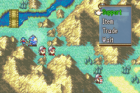

# Supports

## Support Setup

1. Make sure that **support** is checked in the Constants editor

2. Assign a support pair to your two units, with at least one support rank

3. Make sure that your support constants are set up how you want them.

## Support Bonuses

Each affinity defines it's own set of combat bonuses at each support level. These bonuses are NOT cumulative. Each row is taken individually, so you could easily do things like have negative bonuses for a middle support conversation (before the characters inevitably make up).

You can also define pair specific bonuses in the Support Pairs editor. These do not override the normal affinity bonuses the pair would receive, but are applied in addition to the normal affinity bonuses.

## Support Conversations

In order for units to gain support points with one another, they must do the actions you specified in the Support Constants editor. This can be waiting next to one another, interacting with one another, or just being deployed in the same chapter together.

In addition, you must also set the `_supports` game variable to True in an event.

`game_var;_supports;True`

This tells the engine you want units to gain support points now. It starts off by default if you want to introduce supports at a later time in the game.

Now, when two units that are capable of supporting each other reach their first support rank, they'll be able to "Support" one another. This action fires the `on_support` event trigger.

Support conversations themselves are very similar to Talk conversations in overall structure. Create an event with the `on_support` trigger. `unit` and `unit2` are the units that are in the support conversation, and `item` is the ID of the support rank.

So if you wanted an event to show when Eirika and Seth have their C support, your condition for that event would be:

`check_pair('Seth', 'Eirika') and item == 'C'`
