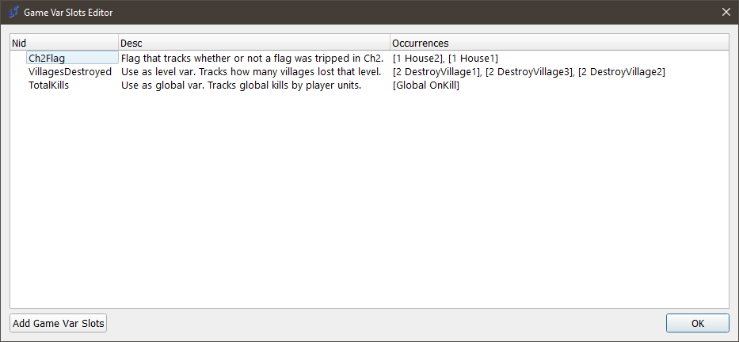
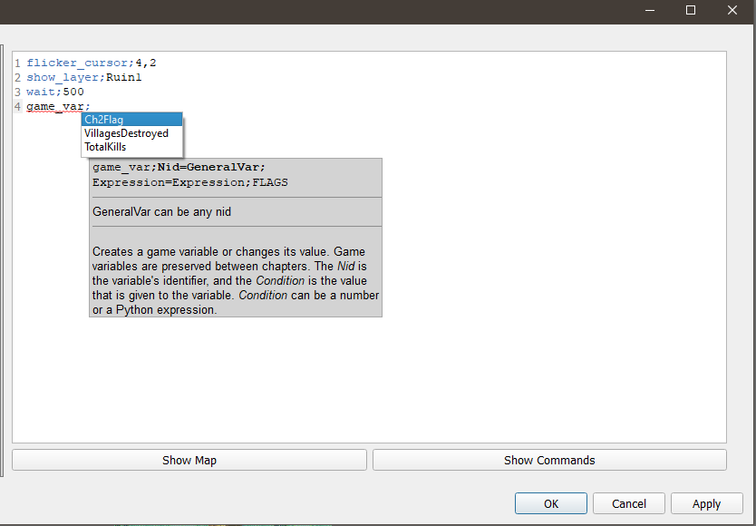
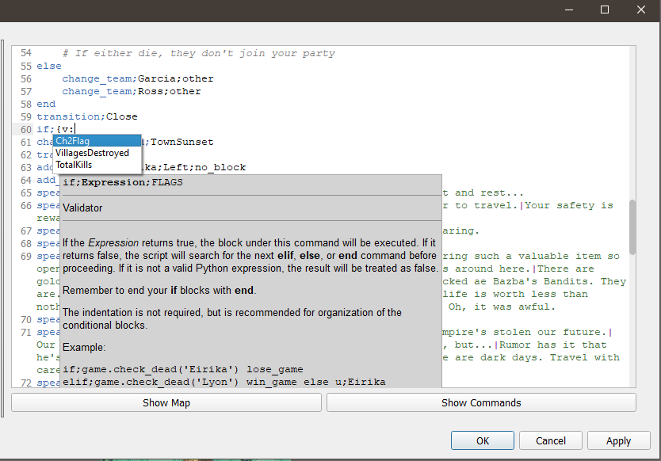

# Var Slots Editor
The Var Slots Editor is an editor that allows you to predefine common `GameVar`s that you may use repeatedly throughout the hack. The editor does not do anything on its own; rather, it helps other editors, such as the Event Editor, function more smoothly, by giving the editor knowledge of common variable names.
## The Example Problem
**I am making a Gaiden Chapter in my game.**
If the player finds three hidden statues in the Prologue, Chapter 5, and Chapter 12, as well as interact with the puppy on Chapter 7, then they will unlock Chapter 19x. The events for this may appear as follows:
```
# Prologue - If UNIT finds with Statue:
game_var;StatueFoundCh1;True
```
```
# Chapter 5 - If UNIT finds with Statue:
game_var;StatueFoundCh5;True
```
```
# Chapter 7 - If UNIT interacts with Puppy:
game_var;PuppyInteractedCh7;True
```
... And so on. This isn't so bad. However, you've worked on this game for a long time. There are, oh, about ~253 different variables tracking various different flags, and you can't be expected to remember them all, and remember where they occur, or what they do. Worst of all - you have to type them properly each time, or else your conditions will not work, or some other bug will occur, and it'll take ages to debug.
## The Var Slots
The Var Slots editor allows you to predefine all of these names. It's not a very complex editor - it's mostly a glorified list of strings. But it saves time on all of the above, if you're a heavy eventer or your project is large.



This is the editor. It consists of a single list with three parts: the predefined variable name, a brief description that you can fill out, and finally, a field that contains the locations of all references to the predefined variable name. By filling out the first two fields, you accomplish two things. You write down for future you the exact name of the variable, and a note on what exactly it's used for.

There is one final feature of this list - all predefined variables in this list can be autocompleted anywhere a game or level variable is referenced or required:





This should dramatically reduce the number of headaches you get from debugging misspellings. Happy devving!