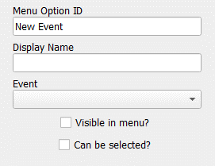

# Overworld Nodes

This guide will serve as an introduction to the “Overworld Node Menu Options” feature. If you have not done so, please read the guide on Overworlds in order to familiarize yourself with how they work, before reading this guide.

Overworld Node Menu Events are basically menu options that will appear when a player selects an Overworld Node that they are standing on. When selected, these options will call an event. There are various features available to control how much access the player has to these options.

To demonstrate how this feature works, we will create an Overworld Armory on Renais Castle.

Before we start with the new features, let's set up the event we need.

Keeping it short and simple for tutorial purposes. This event prompts the player to select a unit from their party, and then initiates a shop with that unit. The trigger, condition, and priority for this event do not matter, Node Menu options ignore these.

**IMPORTANT**: The event **MUST** be Global (not tied to any level or Debug), or else it cannot be called by the Overworld Node Menu Option.

Now that that's set up, let's walk through how to create a Node Menu Option. Navigate to the Overworld Editor, and select any node (I will be using Renais Castle, which is node NID 25 in the Sacred Stones project). To create a menu option for the node, click on the “Create Event” button.

The new option will be automatically selected, and you will be presented with the following attributes.

Menu Option ID: This is the unique identifier of the option. Note that  this identifier is only unique for the Node itself (i.e., Two different nodes can have an option with the ID of “Armory”, but a single node cannot have 2 options of ID “Armory”).

Display Name: This is the name that is shown to the player in the menu. Mostly just aesthetic.

Event: The event this option will call. Only Global events will be available from this drop down.

Visible in Menu?: Whether this option is visible in the menu by default. Can be changed during gameplay via events. If an option isn't visible, it cannot be selected even if it is enabled. If visible but not enabled, the option will be grayed out.

Can be selected?: Whether this option is enabled by default. Can be changed during gameplay via events. If an option isn't visible, it cannot be selected even if it is enabled. If visible but not enabled, the option will be grayed out.

From here, we can set up our menu option.

Our Node Menu Option is now ready! Time to test it in-engine. For this example, I have set things up such that the Overworld is triggered after the prologue, with both Border Mulan and Castle Renais being available. I have also given the party some money.

We simply need to navigate the party onto Castle Renais, and... voila! Our event is available.

Let's select our event and see what happens.
We're given a (kinda ugly, I didn't care about the aesthetics) menu prompting us to select the unit to shop with. 

Select any of them, and...!

The shop works!

And that's all it takes to make a simple Node Menu Option. In the next tutorial, we will explore this feature in more depth, and go over the events you can use to alter the player's access to Node Menu Options.

