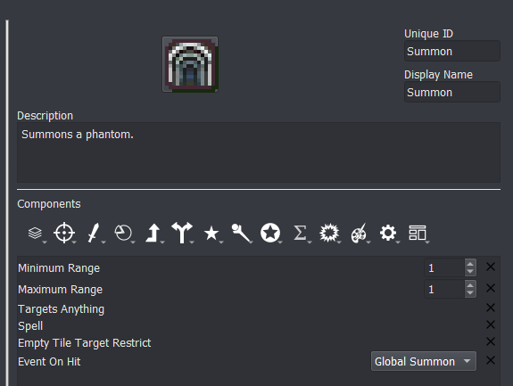
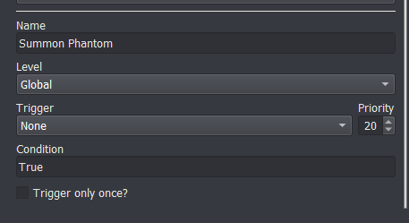
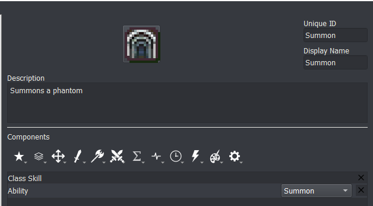

# Summoning

_last updated v0.1_

## Summoning a generic phantom



Items can call an event when they hit using the *Event on Hit* component. Assign this component to the item you want to do the summoning. For summoning a generic phantom, you'll want to make sure the item targets an empty space using the *Empty Tile Target Restrict* component. 



```
# Phantom will always be the same level as the summoner
if;game.get_unit('phantom')
    resurrect;phantom
    remove_unit;phantom;warp
    autolevel_to;phantom;unit.level
else
    make_generic;phantom;Fighter;unit.level;player
end
add_unit;phantom;{position};warp
wait;200
```

Assingn the *Event on Hit* component to a global event that creates a generic unit and places it on the map. If the unit already exists, you can just resurrect the unit (in case the unit is dead) and then remove the unit from the map and place it back on the field at the correct position `{position}`.

If you have multiple summoners who each have a personal phantom, you can give each one a unique nid instead of `phantom`.

## Summoning multiple generics (Echoes-style)

This is done very similarly to summoning a single phantom. The event itself just summons multiple new generics around the user `{user}`. For this event, the soldiers are on the ally team.

```
make_generic;;Soldier;1;other;Pursue
add_unit;{unit};{position};warp;closest
make_generic;;Soldier;1;other;Pursue
add_unit;{unit};{position};warp;closest
make_generic;;Soldier;1;other;Pursue
add_unit;{unit};{position};warp;closest
make_generic;;Soldier;1;other;Pursue
add_unit;{unit};{position};warp;closest
wait;200
```

## Summoning as an ability

You can turn any item into an ability that a skill grants very easily.



Just add the *Ability* component to the skill!
