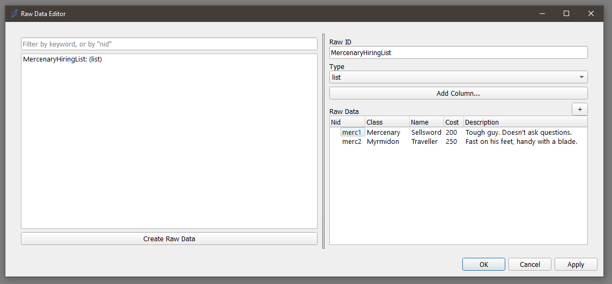
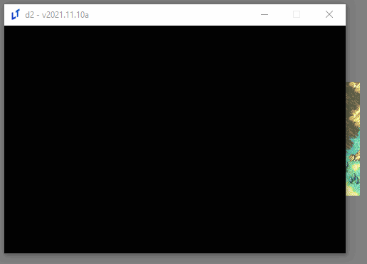
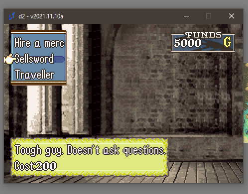
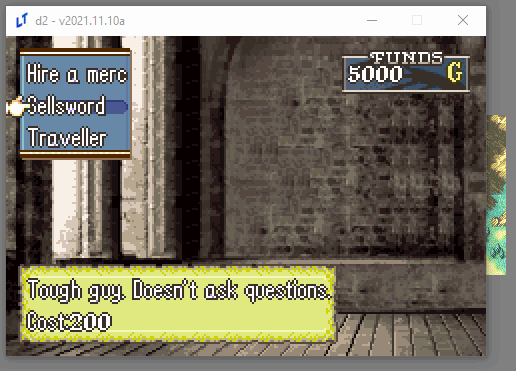

# A Simple Mercenary Shop Tutorial

## Problem Description

I'd like to make a [choice menu](Choices-and-Battle-Saves) shop that, say, hires mercenaries for the map to make it easier.

## Solution

First, please read the choice menu documentation linked above for a basic intro to choices. Having done that, this should be more or less straightforward.

## Raw Data

First, let's do some preparatory work. We need some data first; what classes should we use? What will their names be? How much will they cost? Do we want flavor text? How about all of the above?

In the **Raw Data Editor**, you can write all of these down:



This is just data; it doesn't do anything, but we can access it elsewhere.

## Choice Eventing

Such as in a choice command:

```
choice;MercenaryHireChoice;Hire a merc;{eval:','.join([merc.nid + '|' + merc.Name for merc in game.get_data('MercenaryHiringList')])};;vert;top_left;;;FLAG(persist)
```

Let's break this command down.

1. `choice` - this is a `choice` command. You know what those are, right?
2. `MercenaryHireChoice` - this is the nid we're going to save our choice in.
3. `Hire a merc` - this is the flavor text for the choice.
4. `{eval:','.join([merc.nid + '|' + merc.Name for merc in game.get_data('MercenaryHiringList')])}` - now we're getting somewhere. This is an eval that
   1. Gets all of the data we write in the raw data editor ( `game.get_data('MercenaryHiringList')`)
   2. Iterates through it, and makes a list that looks like this: `['merc1|Sellsword', 'merc2|Traveller']`
      1. Note the bar notation - that means that the first thing ( `merc1, merc2` ) is going to be what's saved in the choice, while the second ( `Sellsword, Traveller`) is what's going to be displayed.
   3. Turns the list into a string ( `','.join()`) that the choice command understands: `merc1|Sellsword,merc2|Traveller`
5. `vert;top_left` - puts makes the menu vertical and puts in the top-left, since having all choices in the center doesn't look that great, and
6. `FLAG(persist)` - makes sure that we can make multiple choices on this menu, like a true shop.

Let's add a command to make sure we've written it all correctly (remember, press 'B' to end the choice, since otherwise it won't, because it's persistent):

```
choice;MercenaryHireChoice;Hire a merc;{eval:','.join([merc.nid + '|' + merc.Name for merc in game.get_data('MercenaryHiringList')])};;vert;top_left;;;FLAG(persist)
speak;Eirika;you chose {var:MercenaryHireChoice}
```


Looking good. But wait; don't we want to know the price and our current money, to see if we can afford it?

## Tables for fun and profit

We can use tables, in concert with `expression` data types and the data we wrote earlier, to display these things. Be warned: this one's a doozy.

```
table;MercDescription;["{d:MercenaryHiringList.{v:MercenaryHireChoice_choice_hover}.Description}", "Cost: {d:MercenaryHiringList.{v:MercenaryHireChoice_choice_hover}.Cost}"];;(2, 1);;bottom_left;menu_bg_parchment (menu_bg_parchment);FLAG(expression)
```

You probably want to copy that into a different text editor to look at while reading this tutorial, since it's _long_.

Let's break it down:

1. `table` - this is just the command.
2. `MercDescription` - this is the nid of our table. We'll need to use it to delete the table after we're done with it.
3. And, the star of the show, the expression. Don't be afraid; it's long, but it's simple.

`["{d:MercenaryHiringList.{v:MercenaryHireChoice_choice_hover}.Description}", "Cost: {d:MercenaryHiringList.{v:MercenaryHireChoice_choice_hover}.Cost}"]`

1. `"{d:MercenaryHiringList.{v:MercenaryHireChoice_choice_hover}.Description}"` - This is a method of querying raw data. Using the `{d:}` command (which is shorthand for `{data:}`), you can fetch the MercenaryHiringList directly.
   1. `{v:MercenaryHireChoice_choice_hover}` - We can actually access the currently-hovered choice in the choice with nid `MercenaryHireChoice` by attaching `_choice_hover` to it. Therefore, this resolves to either `merc1`, or `merc2`, depending on what' being hovered at the moment.
   2. Once you know that, it's simple to see what this code block is doing. It resolves to something like, `MercenaryHiringList.merc1.Description`, which is a way to get the `merc1` row in our raw data, and getting their Description and Cost fields.
   3. Finally, since we're using an `expression` type, this should evaluate into a list, rather than a string. Therefore, we wrap both of them in brackets - `[Description, Cost]`. We add a word, `Cost: ` to the cost section to pretty things up, but it's not necessary.
2. `(2, 1)` - this indicates the size of the table in `(rows, columns)`. We have two rows - one for each line of text - and one column.
3. `bottom_left` - puts the table in the bottom left. Don't want the screen to get too busy, right?
4. `menu_bg_parchment` - let's use a different menu bg for this one for aesthetics. (This actually looks uglier, but I needed to work bgs into a tutorial somehow).
5. `FLAG(expression)`. This is the other star of the show. This tells the engine to constantly eval the expression that we wrote above, and update the table with it.

Let's look at our work:



Great success!

We also need a gold display. This one is easy in comparison:

```
table;GoldDisplay;[game.get_money()];;;60;top_right;funds_display;FLAG(expression)
```

Another breakdown:

1. `GoldDisplay` is the NID of the table.
2. `[game.get_money()]` is yet another `expression`, that returns a list with a single item: the current gold.
3. `60` is a field we haven't used before, the `Width` field - this determines the width of the field. I use this here mostly for aesthetics; otherwise, the gold number won't be aligned with the left side of the bg.
4. `funds_display` is the name of the stunning BG you're about to see. Unlike the others, this one is a sprite, not a menu_bg, and therefore doesn't automatically resize itself. Tables and choices support both kinds of bgs.
5. `FLAG(expression` - what would we do without you?



Lookin' good!

Finally, let's tie it all together.

## Events from Choices

Let's write a confirmation dialogue event, similar to the one in the existing choice tutorial. Let's name this **ConfirmMercHire.**

```
choice;Confirmation;You sure?;Yes,No
if;game.game_vars.get('Confirmation', None) == 'Yes'
    alert;You hired {d:MercenaryHiringList.{v:MercenaryHireChoice}.Name}.
    give_money;{eval: -1 * int({d:MercenaryHiringList.{v:MercenaryHireChoice}.Cost})};FLAG(no_banner)
    make_generic;;{d:MercenaryHiringList.{v:MercenaryHireChoice}.Class};{e:game.get_unit('Eirika').level};player;;Soldier (Soldier);;Iron Sword (Iron Sword)
    add_unit;{created_unit};(3, 4);immediate;closest
    speak;;{d:MercenaryHiringList.{v:MercenaryHireChoice}.Class}
end

```
All of this should be straightforward; display an alert, remove gold via the same expression that we've been using this entire time to read from our raw data; make a generic unit with the klass from that same raw data, and then add the newly `{created_unit}` (the output of `make_generic`) to the map.

Let's add this to the main command:

```
choice;MercenaryHireChoice;Hire a merc;{eval:','.join([merc.nid + '|' + merc.Name for merc in game.get_data('MercenaryHiringList')])};;vert;top_left;;ConfirmMercHire;FLAG(persist)
```

Let's see what happens now:



And we're done.

## Reference

Here is the code used in this tutorial:

**Main code:**

```
table;MercDescription;["{d:MercenaryHiringList.{v:MercenaryHireChoice_choice_hover}.Description}", "Cost: {d:MercenaryHiringList.{v:MercenaryHireChoice_choice_hover}.Cost}"];;(2, 1);;bottom_left;menu_bg_parchment (menu_bg_parchment);FLAG(expression)
table;GoldDisplay;[game.get_money()];;;60;top_right;funds_display (funds_display);FLAG(expression)
choice;MercenaryHireChoice;Hire a merc;{eval:','.join([merc.nid + '|' + merc.Name for merc in game.get_data('MercenaryHiringList')])};;vert;top_left;;ConfirmMercHire (0 ConfirmMercHire);FLAG(persist)
rmtable;MercDescription
rmtable;GoldDisplay
```

**Confirmation dialogue code (ConfirmMercHire):**

```
choice;Confirmation;You sure?;Yes,No
if;game.game_vars.get('Confirmation', None) == 'Yes'
    alert;You hired {eval:game.get_data('MercenaryHiringList').get(game.game_vars.get("MercenaryHireChoice")).Name}.
    give_money;{eval: -1 * int(game.get_data('MercenaryHiringList').get(game.game_vars.get("MercenaryHireChoice")).Cost)};FLAG(no_banner)
    make_generic;;{eval:game.get_data('MercenaryHiringList').get(game.game_vars.get("MercenaryHireChoice")).Class};{eval:game.get_unit('Eirika').level};player;;Soldier (Soldier);;Iron Sword (Iron Sword)
    add_unit;{created_unit};(3, 4);immediate;closest
end
```