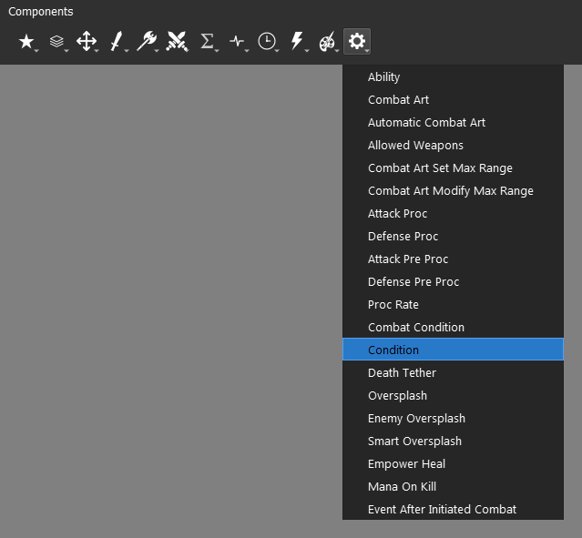
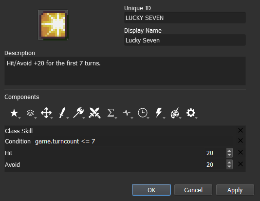
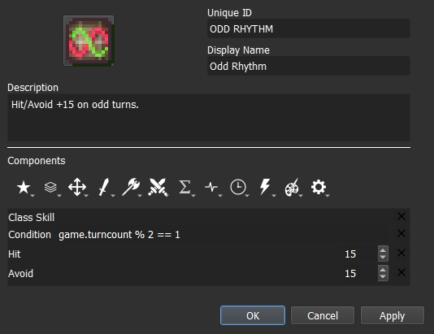
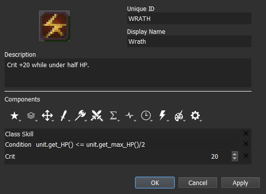
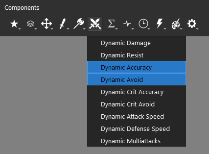
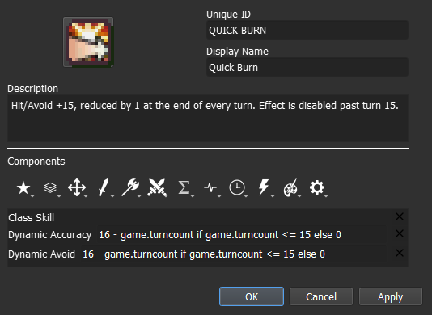
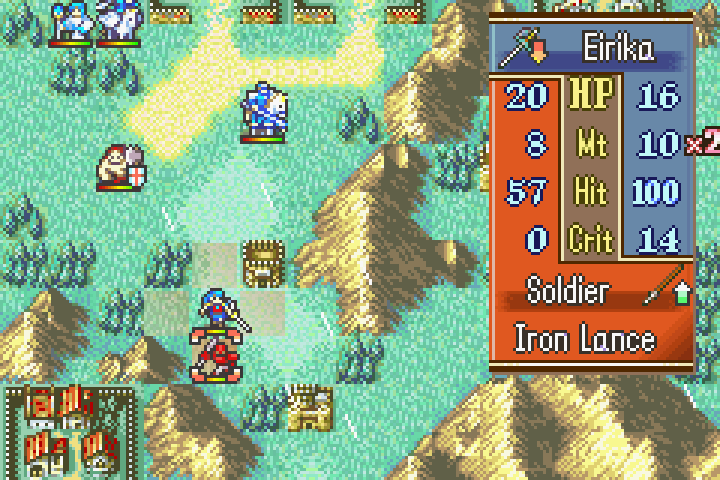

# 2. Conditional Passives I - Lucky Seven, Odd Rhythm, Wrath and Quick Burn
Many skills have conditions to be activated, even the ones that have passive effects. In this guide we will take a look at the basic conditions for passive skills.

As a reminder, **Lex Talionis** is developed in **Python**, so the conditions set by the user will also be subject to the same syntax.

**INDEX**
* **Required editors and components**
* **Skill descriptions**
* **Step 1: Create a Class Skill**
* **Step 2.A: Add the combat components**
* **Step 3: Add the Condition component**
* **Step 4: Set the condition**
	* Step 4.A: **[Lucky Seven]** Set a simple condition
	* Step 4.B: **[Odd Rhythm]** Set a condition with an expression
	* Step 4.C: **[Wrath]** Set a condition with an expression using attributes and methods
* **Step 2.B → 4.D: [Quick Burn] Add the Dynamic Components**
* **Step 5: Test the stat alterations in-game**

## Required editors and components
* Skills:
	* Attribute components - Class Skills
	* Combat components - Avoid, Hit and Crit
	* **Advanced components** - **Condition**
	* **Dynamic components** - **Dynamic Avoid** and **Dynamic Accuracy**
* **Objects, Attributes and Methods:**
	* **game** - **turncounter**
	* **unit** - **get_HP()** and **get_max_HP()**

## Skill descriptions
 - **Lucky Seven** - Hit/Avoid +20 for the first 7 turns.
 - **Odd Rhythm** - Hit/Avoid +15 on odd numbered turns.
 -  **Wrath** - Crit +20 while under half HP.
 -  **Quick Burn** - Hit/Avoid +15, reduced by 1 at the end of every turn. Effect is disabled past turn 15.

## Step 1: Create a Class Skill

## Step 2.A: Add the combat components

## Step 3: Add the Condition component
There are many conditional and trigger components, for this guide we will use the **Condition component** that can be found within the **Advanced Components** menu, represented by the **Gear icon**.

The **Condition component** requires a statement. If the condition is true, then the rest of the skill takes effect. If the condition is false, then the rest of the skill is disabled.

Here are some few illustrative examples:
|Statement|Output|
|--|--|
|Orange is Fruit|True|
|Orange is not Fruit|False
|Orange is not Vegetable|True
|4 + 2 == 6|True
|6 == 4 - 2|False
|3 + 0 > 1|True
|Orange is Angry|Invalid, return
|Orange == Apple|False
|Orange > Apple|Invalid, return

Very basic components like **Class Skill**, **Negative**, and **Hidden** won't be affected by it. It is highly recommended to test if the **Condition component** is interacting with whichever other component you may use.

## Step 4: Set the condition
Conditions can be done by doing a direct comparison or adding expressions to either, or even both, of the sides. The required elements will be dependent on the type of *variables* you need to access and which operations can be performed with them.

Both *Lucky Seven* and *Odd Rhythm* will need the information regarding the current turn. This value is stored in the attribute **turncount**, found in the class **game**, and is updated automatically after the enemy phase.

We can reference it with the following syntax:

    game.turncount

### Step 4.A: [Lucky Seven] Set a simple condition
Simple conditions only take the bare minimum for it to work, two elements and one **comparison operator**. Some of these conditions may have multiple syntaxes.

The syntax for **conditions** is:

    {A} <comparison operator> {B}

Here's the list of all **comparison operators**:
|Operator|Explanation|Notes
|--|--|--|
|==|A is equal to B|-
|!=|A is different from B|-
|>|A is greater than B|Numeric only
|<|A is smaller than B|Numeric only
|>=|A is greater or equal to B|Numeric only
|<=|A is smaller or equal to B|Numeric only
|is|A is equal to B|Object only
|is not|A is different from B|Object only
|in|A exist in B|B must be an iterable
|not in|A doesn't exist in B|B must be an iterable

Now that we know all the syntaxes, it's time to list all our pieces.

 - The **turn counter** variable stores the number corresponding to the current turn.
 - *Lucky Seven* effect only applies for the **first 7 turns**
 - We need **two elements** to settle a condition

These will converge in the following **condition**, where the skill will be active for the first 7 turns, and then disable afterwards:

	game.turncount <= 7

Our skill should end up like this:

### Step 4.B: [Odd Rhythm] Set a condition with an expression
We'll expand from where we left at the previous step. The major change will be the **expression** used as a replacement for one of our elements, along a different **operator** that fits our requirements.

**Expressions** require at least one **arithmetic operator** to generate a value, which are very similar to their regular counterparts.

The syntax for **expressions** is:

		{A} <arithmetic operator> {B}
		{A} <arithmetic operator> {B} <arithmetic operator> {C}
    {A} <arithmetic operator> {B} <arithmetic operator> {C} ... <arithmetic operator> {H} ... ∞

Here's the list of all **arithmetic operators**:
|Operator|Explanation|Notes
|--|--|--|
|+|Addition
|-|Subtraction
|*|Multiplication
|\**|Exponentiation
|/|Division
|//|Floor division|Will return an integer, rounded down
|%|Modulus|Returns the remainder of a division

By definition, and odd number is a number that has a remainder when divided by 2. So our **expression**, and **condition**, should be:

	game.turncount % 2 == 1

Our skill should end up like this:

### Step 4.C: [Wrath] Set a condition with an expression using attributes and methods
Again, we will expand from where we left at previous side step. This time, we'll use expressions in both sides of our condition, and they will use two new variables.

For *Wrath*, we'll need to retrieve information regarding the skill holder. To do so, we need to call the **unit object**. This object is used to reference the holder/wielder/user of a **skill** or **item**. It takes the direct unit using it which may or not be the actual target of the **skill** or **item**.

For **current HP** and **maximum HP** values, we need to call the respective methods from the **unit object**:

	get_hp()

and

	get_max_hp()

With these in hand, we can finally set our **condition** as:

	unit.get_hp() <= unit.get_max_hp() / 2

Our skill should end up like this:

## Step 2.B → 4.D: [Quick Burn] Add the Dynamic Components
At last, we will get into a new type of component that can handle a non-fixed value. Instead of a static number, it can take formulas or other attributes as its value, such as the user level, the number of allies within a given range or even an unrelated different stat. **Dynamic Components** can also carry **condition**, including **expressions**, within them, which allows it to provide two different outputs depending on the result.

Dynamic battle components are represented by the **Crossed Swords icon**. The only exception is the **Dynamic Damage Multiplier component**, found within the **Combat Components**.

For *Quick Burn*, we will need to use the closest approximation available. These will be **Dynamic Accuracy component** as the **Hit component** replacement and **Dynamic Avoid component** as the **Avoid component** replacement.

We can then add our formula using the elements from steps 3 and 4.

Since it should only matter for the first 15 turns, it will end up as something like:

	game.turncount <= 15

Since we are using **Dynamic Components**, we can chose between using the **Condition component** or adding the condition to the **Dynamic Component** itself.

In this particular case, it can be a matter of preference but we will add it to the **Dynamic Component** to expand our reach of possibilities.

The syntax will be different from what we did so far as it needs the whole If-Else statement to work.

It uses the following structure:

	{True value} if {condition} else {False value}

Now we add our values and condition to get:

	16 - game.turncount if game.turncount <= 15 else 0

or

	max(0, 16 - game.turncount)

Either one will work. Our skill should end up like this:

One important thing to know about **Dynamic Components** is that they won't be displayed in on the **unit information window** when inspected. They are only added once the game calculates the attack. You need to declare an attack in order to see the stats change. There's no need to execute it however.

## Step 5: Test the stat alterations in-game
